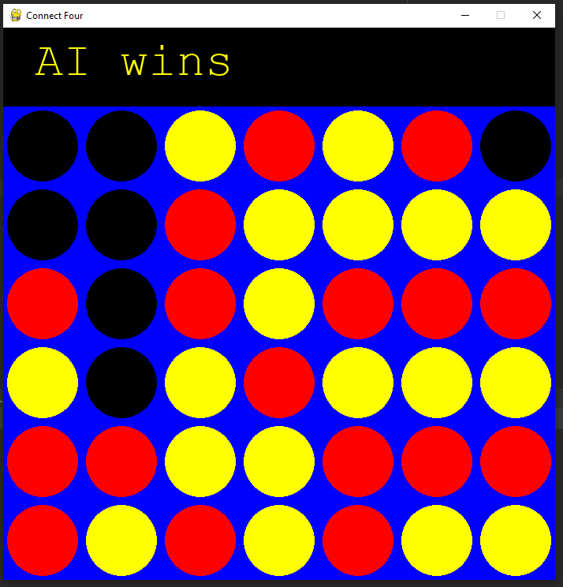

# Connect-Four-AI
**Connect 4** is a two-player game in which the players first choose a color and then take turns
dropping their colored discs from the top into a grid. The pieces fall straight down, occupying
the next available space within the column. The objective of the game is to connect-four of
one’s own discs of the same color next to each other vertically, horizontally, or diagonally.
<p align="center"></p>

## Modes
- Normal Mode
  - Standard connect four gameplay where a player aims to connect four tiles of the same color to win. 
  - The player that connects four tiles first wins.
- Full mode 
  - Alternate approach to the standard connect four where a player aims to gain the maximum number of four connected tiles. 
  - The player with a higher number of four connected tiles wins.

## Features
The full game tree is very huge 𝑂(10^35) so it is impossible to traverse it till the terminal states instead we designed a suitable heuristic function 
that evaluates the state of a game and returns a number indicating whether the computer is near to win or lose and truncate the game tree after K levels, 
evaluating the states using the heuristic function.

## Minimax
Minimax is a kind of backtracking algorithm that is used in decision making and game theory to find the optimal move for a player, 
assuming that your opponent also plays optimally.
- Depth-first search of the game tree.
- An optimal leaf node could appear at any depth of the tree.
- Minimax principle: compute the utility of being in a state assuming both players play optimally from there until the end of the game.
- Propagate minimax values up the tree once terminal nodes are discovered.
### Types
- Without Pruning
  - Traversing whole tree.
- With Pruning
  - Optimization on the previous minimax approach.
  - Traversing the entire tree is not necessary given the alpha>=beta condition is True.
  - alpha: largest value for Max across seen children (current lower bound on MAX’s outcome).
  - beta: lowest value for MIN across seen children (current upper bound on MIN’s outcome).
  - Initialization: alpha = - infinity, beta = infinity
  - Propagation: Send alpha, beta values down during the search to be used for pruning.
    - Update alpha, beta values by propagating upwards values of terminal nodes.
    - Update alpha only at Max nodes and update beta only at Min nodes.

## Heuristic Function
- Win State → 4 consecutive pieces (Score: 30)
- 3 in a row
  - Bottom row is given highest weighting because it enables board control (Score: 8)
  - Other rows follow an Even/Odd approach while prioritizing lower rows
    - This approach enables odd or even player players to take advantage of the ordering of turns
    - Even turn player has higher weighting for even rows (2, 4, 6)
      - Row 2 (Score: 8)
      - Row 4 (Score: 7)
      - Row 6 or 3 (Score: 6)
      - Other rows (Score: 5)
    - Odd turn player has higher weighting for odd rows (3, 5)
      - Row 3 (Score: 8)
      - Row 5 (Score: 5)
      - Row 2 (Score: 6)
      - Other rows (Score: 5)
- 3 in a column
  - Middle column has highest weighting (Score: 8)
  - Column 3 & 4 (Score: 7)
  - Column 2 & 6 (Score: 6)
  - Other Columns (Score: 5)
- 2 Consecutive
  - Given lower weighting than 5
  - Weighting of rows follows even/odd approach
  - Weighting of columns follows higher weighting for middle rows
- Blocking Opponent
  - Negative weighting to decrease the state’s overall score
  - Opponent getting 3 consecutive pieces (Score: -20)
  - Opponent getting 2 consecutive pieces (Score: -10)

## How To Run
1. Install the following libraries using ```pip install library```
    - ```pygame```
    - ```numpy```

2. Navigate to the project folder
3. Run command ```py main.py```

